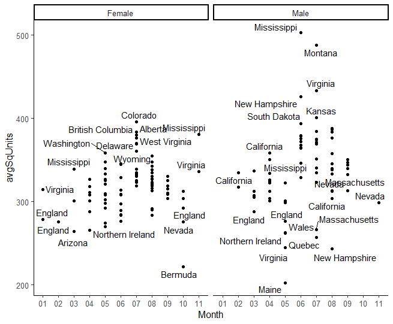
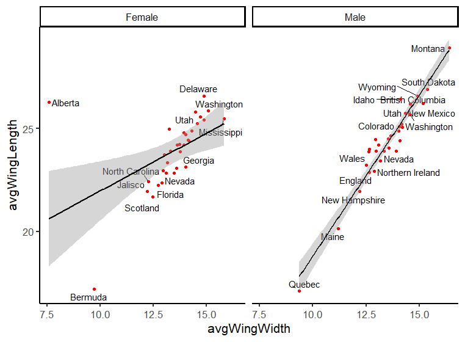
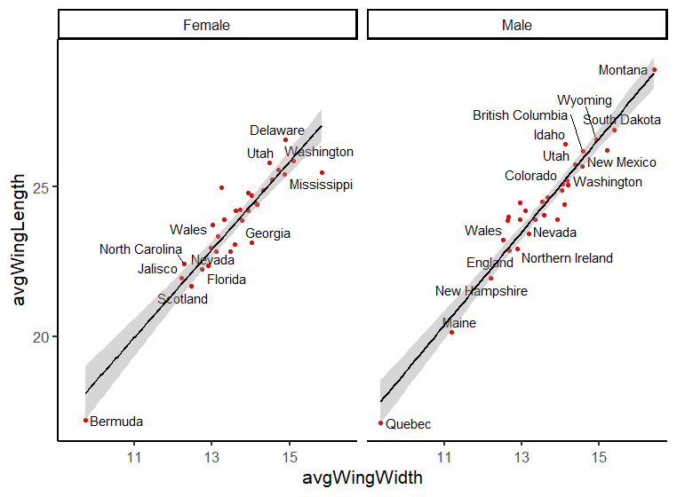
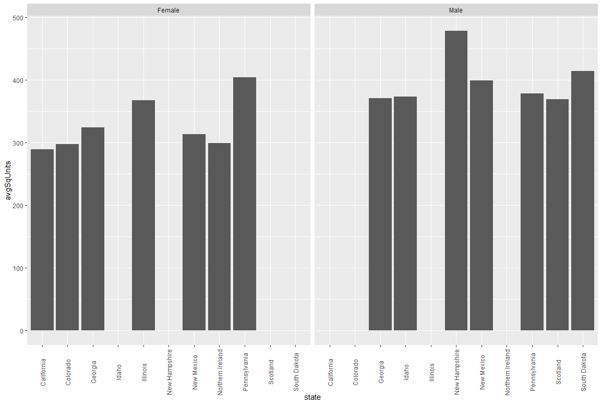
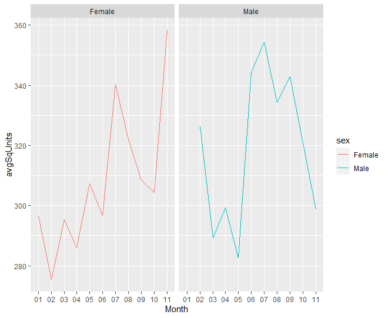
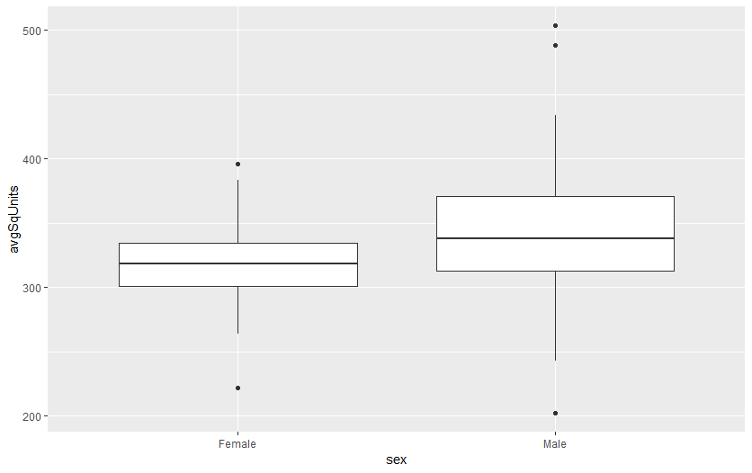
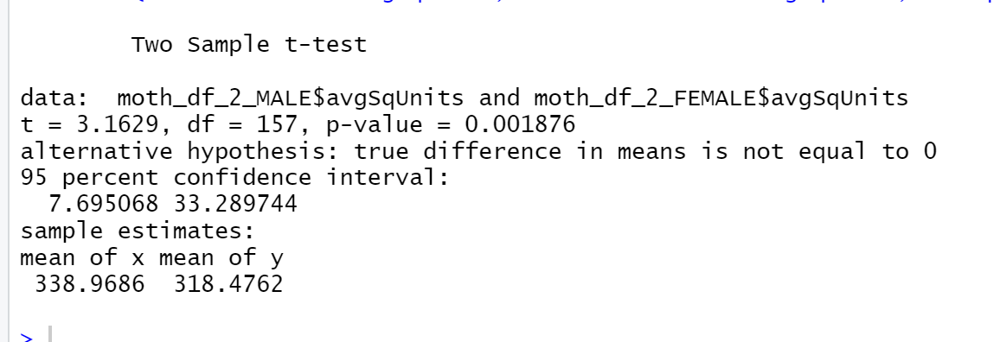

# Final_Project
### Failures
* Cleaning the sex column - dealing with NA and different names in the column
* Cleaning and creating the dates column
* Couldn’t figure out how to create line graphs for each state - partially because not every state had data for each month
* There was to many points in the scatterplot for wing length and wing width by state. 
* States names were scattered within our graph. This made it hard to know which state was with which point

