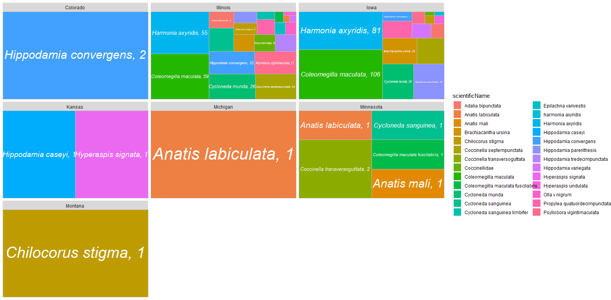

# Final_Project
## Graph 1
* We wanted to show which species were most prevelent in each state. However, we were extremely limited in displaying this because mostly all the data was collected in either Illinois or Iowa.
### Failures
* Finding a way to count state name and scientific name at the same time.
* How to space the data.

## Graph 2
* We wanted to show the number of observations by year for each species.
### Failures
* While this graph does display its purpose, it is not very easy to read and lookig back, a stacked bar chart would have been better.

## Graph 3
* We wanted to show the number of observations by month for each species.
* The goal was to determine if the amount of ladybugs increase during certain times of the year. 
* It was pretty easy to tell that months 7 and 8 were peak ladybug season.
### Failures
* When month was a character it wouldn't format properly. We had to change month to a number and the x axis is scaled to month 5, 7.5, and 10.
* Graph would have been clearer if it was just a stacked bar chart.

## Graph 4
* We wanted to show some of the statistics for months 7 and 8 to determine if one month was better than the other.
* It was hard to determine if the datasets were statistically similar or not so we created a ttest to see.

* We were able to determine that month 7 and 8 were statistically similar and that they both can be considered equally peak ladybug season. 

