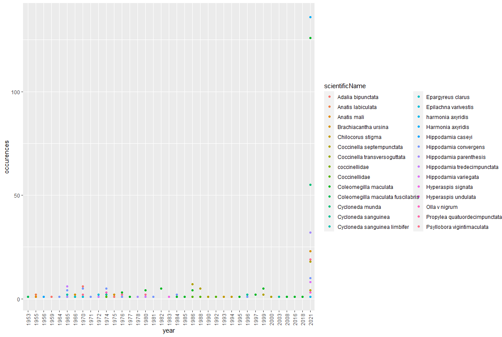

# Final_Project
## Selecting and cleaning the data
* We needed to select the data we needed from the given dataset
* Then, we needed to clean the data so that sex, country, and date were consistent to their respective column formats
* Then we changed all the characters that were measuremnents in units to numbers
### Code
```
moth_df_selected <- moth_df1 %>%
  select(coreid, dwc.genus, dwc.specificEpithet, SexUpdated, LWingLength, LWingWidth, LBlackPatchApex, LAnteriorSpotM3, 
         RWingLength, RWingWidth, RBlackPatchApex, RAnteriorSpotM3, dwc.day, dwc.month, dwc.year, dwc.country, 
         dwc.stateProvince, DecimalLatitudeUpdated, DecimalLongitudeUpdated)

moth_df_selected$SexUpdated <- toupper(moth_df_selected$SexUpdated)

moth_df_selected <- moth_df_selected %>%
  dplyr::rename(genus = dwc.genus, 
                specificEpithet = dwc.specificEpithet,
                day = dwc.day, 
                month = dwc.month, 
                year = dwc.year,
                country = dwc.country,
                state = dwc.stateProvince,
                sex = SexUpdated) %>%
  dplyr::mutate(sex = ifelse(sex == "M" |
                               sex == "MALE", "Male", "Female")) %>%
  dplyr::mutate(country = ifelse(country == "USA" |
                                   sex == "U.S.A", "United States", country)) %>%
  dplyr::mutate(moth_df_selected, Dates=paste(year, month, day, sep="-"))

moth_df_selected$LWingLength <- as.numeric(moth_df_selected$LWingLength)
moth_df_selected$RWingLength <- as.numeric(moth_df_selected$RWingLength)
moth_df_selected$RWingWidth <- as.numeric(moth_df_selected$RWingWidth)
moth_df_selected$LWingWidth <- as.numeric(moth_df_selected$LWingWidth)
moth_df_selected$LBlackPatchApex <- as.numeric(moth_df_selected$LBlackPatchApex)
moth_df_selected$RBlackPatchApex <- as.numeric(moth_df_selected$RBlackPatchApex)
moth_df_selected$LAnteriorSpotM3 <- as.numeric(moth_df_selected$LAnteriorSpotM3)
moth_df_selected$RAnteriorSpotM3 <- as.numeric(moth_df_selected$RAnteriorSpotM3)
moth_df_selected$Dates <- as.Date(moth_df_selected$Dates, format="%Y-%m-%d")
moth_df_selected$Dates <- as.POSIXct(moth_df_selected$Dates, format = "%d-%m-%Y")
moth_df_selected$Year <- format(moth_df_selected$Dates, format = "%Y")
moth_df_selected$Month <- format(moth_df_selected$Dates, format = "%m")
```


## Graph 1


* Attempting to show average size for each state by month. Wanted to show growth of moths throughout the year in each state. 
* We were extremely limited by the following failures and our limited coding experience. 
* We also wanted to create this graph in a line graph, but we discuss the limitations in our failure section below.
### Failures
* Cleaning the sex column - dealing with NA and different names in the column.
* Cleaning and creating the dates column.
* Couldn’t figure out how to create line graphs for each state - partially because not every state had data for each month.
* There was to many points in the scatterplot for wing length and wing width by state. 
* States names were scattered within our graph. This made it hard to know which state was with which point.
### Code
```
moth_df_MALE_2_L <- moth_df_selected %>%
  select(country, state, sex, Month, LWingLength, LWingWidth) %>%
  filter(sex == "Male") %>%
  na.omit(LWingLength) %>%
  group_by(state, sex, Month) %>%
  summarise(lSqUnits = mean(LWingLength * LWingWidth))

moth_df_MALE_2_R <- moth_df_selected %>%
  select(country, state, sex, Month, RWingLength, RWingWidth) %>%
  filter(sex == "Male") %>%
  na.omit(RWingLength) %>%
  group_by(state, sex, Month) %>%
  summarise(rSqUnits = mean(RWingLength * RWingWidth))

moth_df_2_MALE <- moth_df_MALE_2_L %>%
  left_join(moth_df_MALE_2_R, by = c("Month"))

moth_df_2_MALE <- moth_df_2_MALE %>%
  select(state.x, sex.x, Month, lSqUnits, rSqUnits) %>%
  rename(state = state.x, sex = sex.x) %>%
  group_by(state, Month, sex) %>%
  summarise(avgSqUnits = mean((lSqUnits + rSqUnits)/2))

moth_df_FEMALE_2_L <- moth_df_selected %>%
  select(country, state, sex, Month, LWingLength, LWingWidth) %>%
  filter(sex == "Female") %>%
  na.omit(LWingLength) %>%
  group_by(state, sex, Month) %>%
  summarise(lSqUnits = mean(LWingLength * LWingWidth))

moth_df_FEMALE_2_R <- moth_df_selected %>%
  select(country, state, sex, Month, RWingLength, RWingWidth) %>%
  filter(sex == "Female") %>%
  na.omit(RWingLength) %>%
  group_by(state, sex, Month) %>%
  summarise(rSqUnits = mean(RWingLength * RWingWidth))

moth_df_2_FEMALE <- moth_df_FEMALE_2_L %>%
  left_join(moth_df_FEMALE_2_R, by = c("Month"))

moth_df_2_FEMALE <- moth_df_2_FEMALE %>%
  select(state.x, sex.x, Month, lSqUnits, rSqUnits) %>%
  rename(state = state.x, sex = sex.x) %>%
  group_by(state, Month, sex) %>%
  summarise(avgSqUnits = mean((lSqUnits + rSqUnits)/2))

moth_df_2_final <- moth_df_2_MALE %>%
  rbind(moth_df_2_FEMALE)

ggplot(moth_df_2_final, aes(Month, avgSqUnits, label = state)) +
  geom_point() +
  geom_text_repel() +
  theme_classic(base_size = 12) +
  facet_wrap(vars(sex))
```


## Graph 2


* We wanted to show a graph that would show the relationship between wing length and wing width by state.
* The goal was to display the states with the largest moth wing sizes.
* We were able to overlay a linear regression to display the relationship in the scatterplot.
* A secondary goal of this graph was to see if there were clear regions that had larger moths than others. However, the graph was inconclusive in that regard as it was to hard to decipher which region was ideal for moth size. 
### Failures
* One failure or drawback that we had with this graph was scaling it so that it doesn't become too cluttered
### Code
```
moth_df_1_MALE_Length <- moth_df_selected %>%
  select(country, state, sex, LWingLength, RWingLength) %>%
  filter(sex == "Male") %>%
  na.omit(LWingLength) %>%
  group_by(state, sex) %>%
  summarise(avgWingLength = mean((LWingLength + RWingLength)/2))

moth_df_1_MALE_Width <- moth_df_selected %>%
  select(country, state, sex, LWingWidth, RWingWidth) %>%
  filter(sex == "Male") %>%
  na.omit(LWingWidth) %>%
  group_by(state) %>%
  summarise(avgWingWidth = mean((LWingWidth + RWingWidth)/2))

moth_df_1_MALE <- moth_df_1_MALE_Length %>%
  left_join(moth_df_1_MALE_Width, by = c("state"))

moth_df_1_FEMALE_Length <- moth_df_selected %>%
  select(country, state, sex, LWingLength, RWingLength) %>%
  filter(sex == "Female") %>%
  na.omit(LWingLength) %>%
  group_by(state, sex) %>%
  summarise(avgWingLength = mean((LWingLength + RWingLength)/2))

moth_df_1_FEMALE_Width <- moth_df_selected %>%
  select(country, state, sex, LWingWidth, RWingWidth) %>%
  filter(sex == "Female") %>%
  na.omit(LWingWidth) %>%
  group_by(state) %>%
  summarise(avgWingWidth = mean((LWingWidth + RWingWidth)/2))

moth_df_1_FEMALE <- moth_df_1_FEMALE_Length %>%
  left_join(moth_df_1_FEMALE_Width, by = c("state"))

moth_df_1_final <- moth_df_1_MALE %>%
  rbind(moth_df_1_FEMALE) %>%
  filter(state != "Alberta")

ggplot(moth_df_1_final, aes(avgWingWidth, avgWingLength, label = state)) +
  geom_text_repel() +
  geom_point(color = 'red') +
  theme_classic(base_size = 16) +
  geom_smooth(method="lm", col="black") +
  facet_wrap(vars(sex))
```

### Graph 2 cont.
* We wanted to show the similarities between the male and female regression lines without the outlier point in the Female graph - Alberta.


## Graph 3


* We wanted to show the states with the largest moths in square units in more clear fashion
* We grouped the data to month 6 so that the time of year recorded was consistent
### Code
```
moth_df_MALE_4_L <- moth_df_selected %>%
  select(sex, state, Month, LWingLength, LWingWidth) %>%
  filter(sex == "Male", Month == "06") %>%
  na.omit(LWingLength) %>%
  group_by(state, Month, sex) %>%
  summarise(lSqUnits = mean(LWingLength * LWingWidth))

moth_df_MALE_4_R <- moth_df_selected %>%
  select(sex, state, Month, RWingLength, RWingWidth) %>%
  filter(sex == "Male", Month == "06") %>%
  na.omit(RWingLength) %>%
  group_by(state, Month, sex) %>%
  summarise(rSqUnits = mean(RWingLength * RWingWidth))

moth_df_4_MALE <- moth_df_MALE_4_L %>%
  select(state, Month, lSqUnits) %>%
  left_join(moth_df_MALE_4_R, by = c("state"))

moth_df_4_MALE <- moth_df_4_MALE %>%
  group_by(state, sex) %>%
  summarise(avgSqUnits = mean((lSqUnits + rSqUnits)/2))

moth_df_4_MALE <- moth_df_4_MALE %>%
  na.omit(avgSqUnits)

moth_df_4_MALE <- moth_df_4_MALE[with(moth_df_4_MALE,order(-avgSqUnits)),]
moth_df_4_MALE <- moth_df_4_MALE[1:7,]

moth_df_FEMALE_4_L <- moth_df_selected %>%
  select(sex, state, Month, LWingLength, LWingWidth) %>%
  filter(sex == "Female", Month == "06") %>%
  na.omit(LWingLength) %>%
  group_by(state, Month, sex) %>%
  summarise(lSqUnits = mean(LWingLength * LWingWidth))

moth_df_FEMALE_4_R <- moth_df_selected %>%
  select(sex, state, Month, RWingLength, RWingWidth) %>%
  filter(sex == "Female", Month == "06") %>%
  na.omit(RWingLength) %>%
  group_by(state, Month, sex) %>%
  summarise(rSqUnits = mean(RWingLength * RWingWidth))

moth_df_4_FEMALE <- moth_df_FEMALE_4_L %>%
  select(state, Month, lSqUnits) %>%
  left_join(moth_df_FEMALE_4_R, by = c("state"))

moth_df_4_FEMALE <- moth_df_4_FEMALE %>%
  group_by(state, sex) %>%
  summarise(avgSqUnits = mean((lSqUnits + rSqUnits)/2))

moth_df_4_FEMALE <- moth_df_4_FEMALE[with(moth_df_4_FEMALE,order(-avgSqUnits)),]
moth_df_4_FEMALE <- moth_df_4_FEMALE[1:7,]

moth_df_4_final <- moth_df_4_MALE %>%
  rbind(moth_df_4_FEMALE)

ggplot(moth_df_4_final, aes(x=state, y = avgSqUnits, fill = state)) +
  geom_col() +
  theme(axis.text.x = element_text(angle = 90, vjust = 0.5)) +
  facet_wrap(vars(sex))
```


## Graph 4


* We wanted to display moth wing size in square units over the months of the year in a line graph.
* The goal or purpose of this graph was to see if the size of moths increase over the year.
### Failures
* We were unable to determine the conclusiveness of this hypothesis because the data was not consistently from the same place during each month, so, the data may have been more biased in one direction or the other during certain months. 
### Code
```
moth_df_MALE_3_L <- moth_df_selected %>%
  select(sex, Month, LWingLength, LWingWidth) %>%
  filter(sex == "Male") %>%
  na.omit(LWingLength) %>%
  group_by(Month, sex) %>%
  summarise(lSqUnits = mean(LWingLength * LWingWidth))

moth_df_MALE_3_R <- moth_df_selected %>%
  select(sex, Month, RWingLength, RWingWidth) %>%
  filter(sex == "Male") %>%
  na.omit(RWingLength) %>%
  group_by(Month, sex) %>%
  summarise(rSqUnits = mean(RWingLength * RWingWidth))

moth_df_3_MALE <- moth_df_MALE_3_L %>%
  select(Month, lSqUnits) %>%
  left_join(moth_df_MALE_3_R, by = c("Month"))

moth_df_3_MALE_Month <- moth_df_3_MALE %>%
  group_by(Month, sex) %>%
  summarise(avgSqUnits = mean((lSqUnits + rSqUnits)/2))

moth_df_FEMALE_3_L <- moth_df_selected %>%
  select(sex, Month, LWingLength, LWingWidth) %>%
  filter(sex == "Female") %>%
  na.omit(LWingLength) %>%
  group_by(Month, sex) %>%
  summarise(lSqUnits = mean(LWingLength * LWingWidth))

moth_df_FEMALE_3_R <- moth_df_selected %>%
  select(sex, Month, RWingLength, RWingWidth) %>%
  filter(sex == "Female") %>%
  na.omit(RWingLength) %>%
  group_by(Month, sex) %>%
  summarise(rSqUnits = mean(RWingLength * RWingWidth))

moth_df_3_FEMALE <- moth_df_FEMALE_3_L %>%
  select(Month, lSqUnits) %>%
  left_join(moth_df_FEMALE_3_R, by = c("Month"))

moth_df_3_FEMALE_Month <- moth_df_3_FEMALE %>%
  group_by(Month, sex) %>%
  summarise(avgSqUnits = mean((lSqUnits + rSqUnits)/2))

moth_df_3_final <- moth_df_3_FEMALE_Month %>%
  rbind(moth_df_3_MALE_Month)

ggplot(moth_df_3_final, aes(x=Month, y=avgSqUnits, group = 1, color = sex)) +
  geom_line() +
  facet_wrap(vars(sex))
```


## Graph 5 and ttest


* Goal was to determine if male or females were larger, however it was difficult to tell by the graph, so we created a ttest to determine if the two datasets - male and female - were statistically similar.
### Code
```
moth_df_ttest <- moth_df_2_final %>%
  select(sex, avgSqUnits) 

ggplot(moth_df_ttest, aes(sex, avgSqUnits)) +
  geom_boxplot()
```


* We concluded that the datasets were not statistically similar and that the males were larger on average than the females.
### Code
```
t.test(moth_df_2_MALE$avgSqUnits, moth_df_2_FEMALE$avgSqUnits,var.equal = T)
```
